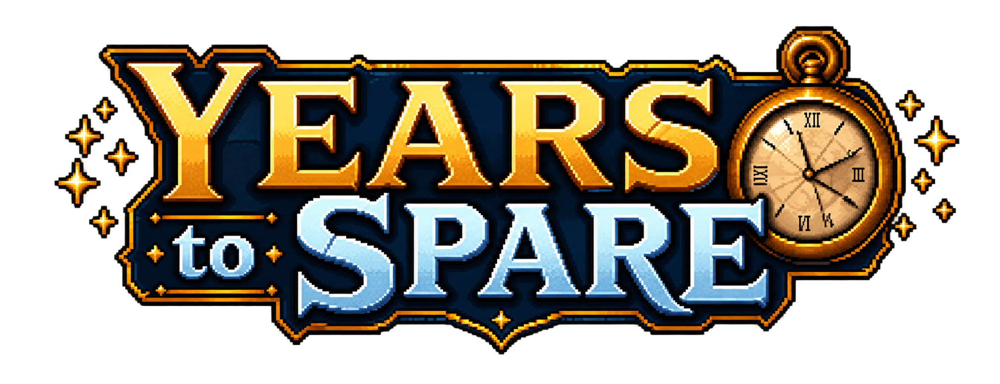

A 2D action-platformer built with **Godot**.

Play as a boy fighting through Cad Corp to find his family. His father's clock
can stop time, but every use costs years of his life. Defeating enemies gives
some of those years back, turning time into both a weapon and the game's main
resource.

## Project status

The project is an in-development prototype with a playable first level,
**Garbage Eden**. It currently includes:

- Responsive platforming, crouching, and melee combat
- A five-second time-stop ability with an age cost and cooldown
- Melee Guards and ranged Gunners
- Checkpoints that preserve age and defeated enemies between retries
- Hazards, moving traps, and healing fig pickups
- Intro, main menu, HUD, music, sound effects, and persistent settings

Only time stop is available in the current level. Rewind and slow-time inputs
exist in the project, but their gameplay is not yet available.

City of Time currently has a title screen only. It returns to Level 1; a playable
second level has not been added yet.

## Running the game

1. Install [Godot 4.7](https://godotengine.org/download/).
2. Clone the repository:

   ```bash
   git clone https://github.com/Zeyadzahran/years-to-spare.git
   cd years-to-spare
   ```

3. Import `project.godot` into Godot.
4. Press **F5** to run the project.

The game starts at `src/cinematics/logo/logo.tscn`. The playable level is
`src/levels/level_01/level_01.tscn`.

## Controls

| Action | Keyboard and mouse | Controller |
| --- | --- | --- |
| Move | `A` / `D` or arrow keys | Left stick |
| Jump | `Space`, `W`, or up arrow | A / Cross |
| Crouch | `S` or down arrow | D-pad down |
| Attack | `J` or left mouse button | X / Square |
| Stop time | `K` or right mouse button | Left shoulder |
| Pause / options | `Esc` | Start |

The intro can be skipped by pressing any keyboard key.

## How time works

The player begins at age 14 and dies of old age at 60. Casting time stop costs
three years, freezes the world for five seconds, and then enters a three-second
cooldown. Defeating an enemy restores one year, while figs restore health.

A normal death returns the player to the latest checkpoint without restoring
spent years or respawning defeated enemies. Dying of old age clears that run's
progress and starts the level again.

## Project structure

```text
assets/                  Shared actor art, fonts, music, sounds, and input icons
autoload/                Event bus, run progress, world time, settings, and music
src/
  actors/                Player and enemies, with their scenes and scripts
  cinematics/            Logo and story intro, each beside its script
  components/            Health, age, and time powers
  core/                  State machine and time-aware body classes
  levels/
    level.gd             Shared level lifecycle and retry handling
    level_01/
      level_01.tscn      Gameplay layout: terrain, hazards, actors, and checkpoints
      decorations.tscn   Placed decorations, grouped by location and drawing depth
      props/             Reusable decoration scenes
      hazards/           Level 1 hazard scenes and animation resources
      art/               Background, terrain, prop, and hazard images
      audio/             Level ambience
      background.tscn    Parallax background
      terrain_tileset.tres
  ui/                    HUD, options, main menu, and configurable level titles
  world/                 Shared checkpoints, pickups, platforms, exits, hazard scripts
docs/                    Level authoring guide and refactor validation notes
tests/                   Scene loading, retry progress, and navigation checks
```

See [Level authoring](docs/level-authoring.md) for where to place decorations,
how the layers work, and which names must remain stable.

For Level 1, edit `level_01.tscn` to place gameplay objects and
`decorations.tscn` to arrange scenery. Decorations are grouped into Entrance,
Trench, BigPit, and Exit sections. Drag reusable scenes from `props/` into a
section instead of copying texture crops by hand. Edit a source prop to change
every copy, or move and flip an instance to change just that placement.

Keep existing enemy paths and checkpoint names stable: retry progress uses them
to remember defeated enemies and the active checkpoint.

## Validation and Web export

After importing the project, run the scene checks from the project root:

```bash
godot --headless --path . --script tests/scene_contracts.gd
```

The checks cover scene loading, startup, checkpoint recovery, defeated enemies,
and title/exit navigation. The current headless run passes its assertions but
reports resource warnings at shutdown; see [validation notes](docs/refactor-plan.md).

Install the export templates matching your Godot version, then use the `Web`
preset in **Project → Export**, or run:

```bash
mkdir -p builds/web
godot --headless --path . --export-release Web builds/web/index.html
python3 -m http.server 8000 --directory builds/web
```

Open `http://localhost:8000` to play the exported build. Replace `godot` with your
Godot executable path if it is not on your PATH. The preset uses Compatibility
rendering and a single thread. Web builds render at the base viewport resolution
before scaling to the browser window; desktop builds retain canvas-item scaling.

## Architecture rule

Do not use `Engine.time_scale` for gameplay. The player must keep moving at full
speed while the world is frozen.

Anything affected by time powers should extend `TimeBody2D` or use
`TimeService.world_delta(delta)`. Player-controlled and UI code should use the
raw delta when it needs to continue during a time stop.

## Adding gameplay

| To add | Where to start |
| --- | --- |
| A player state or ability | Add a `State` under `src/actors/player/states/` and register it in the player's `StateMachine` |
| A player animation | Add the clip to `player_frames.tres` and map it in `PlayerAnimator.STATE_CLIPS` |
| An enemy type | Extend `Enemy`, configure its stats, and implement `_attack()` |
| A Level 1 decoration | Add a reusable scene under `src/levels/level_01/props/`, then place it in `decorations.tscn` |
| A level exit | Instance `src/world/level_exit.tscn` and set its `destination` |
| A level title | Use the scenes under `src/ui/level_title/` and set the root's `next_scene` |
| A time-aware world object | Extend `TimeBody2D` or request scaled delta from `TimeService` |
| A cross-system event | Add a signal to `EventBus` and connect the interested systems |
| Another level | Add it to `GameState.LEVELS` and create its scene under `src/levels/` |
